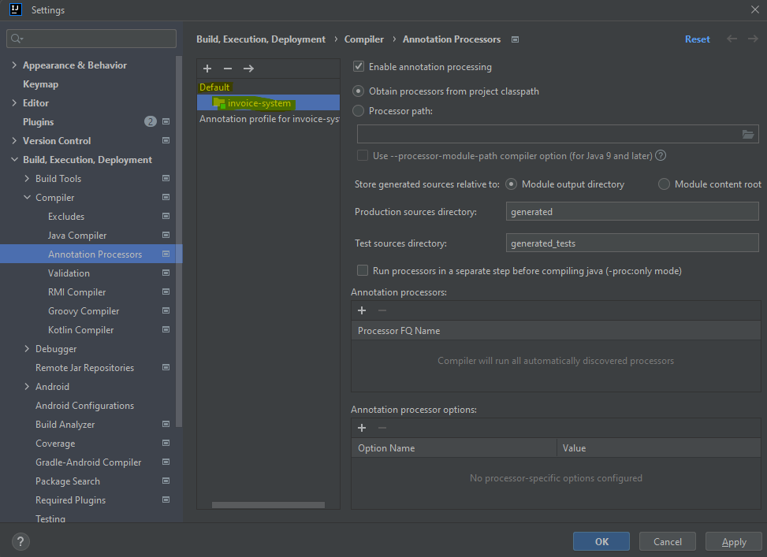

# 🧾 Invoice System

A Spring Boot application that manages **invoice creation**, **payment processing**, and **overdue invoice handling**.  
Supports command/query separation, testing with Testcontainers, and runs with Docker Compose.

---

## 🚀 Features

- ✅ Create and fetch invoices
- 💳 Process payments
- ⏰ Handle overdue invoices with late fees and due date adjustments
- 🧵 Command-Query Separation
- 🧪 Integration testing with JUnit 5 and Testcontainers
- 🐳 Dockerized for easy deployment

---

## 🧰 Tech Stack

| Tech               | Version                      |
|--------------------|------------------------------|
| Java               | 17                           |
| Spring Boot        | 3.5.x                        |
| PostgreSQL         | Main database                |
| Maven              | Build tool                   |
| JUnit 5            | Testing framework            |
| Test Containers    | DB integration testing       |

---
## 📊 Monitoring & Actuator Endpoints

Spring Boot Actuator is enabled for health checks, metrics, and application insights.

## 📦 Modules

The app follows a modular structure:

- `controller` — REST endpoints
- `service.command` — Command-side logic (create/update)
- `service.query` — Query-side logic (read)
- `repository` — JPA repositories
- `dto` — Data transfer objects
- `entity` — JPA entity models
- `exception` — Custom exception handling
- `util` — For common code

---


---

## 📡 REST API Endpoints

| Method | Endpoint                        | Request Body                                                                           | Response Type                         | Status Code   | Description                                             |
|--------|---------------------------------|----------------------------------------------------------------------------------------|---------------------------------------|---------------|---------------------------------------------------------|
| `POST` | `/invoices`                     | [`InvoiceRequest`](#invoicerequest)                                                    | [`InvoiceResponse`](#invoiceresponse) | `201 CREATED` | To create an Invoice                                    |
| `GET`  | `/invoices?isActive=true/false` | _None_                                                                                 | `List<InvoiceView>`                   | `200 OK`      | To get all the invoice/ you can get all active/inactive |
| `POST` | `/invoices/{id}/payment`        | [`PaymentRequest`](#paymentrequest)                                                    | _None_                                | `200 OK`      | Make payment for a given invoice                        |
| `POST` | `/invoices/process-overdue`     | [`ProcessOverdueRequest`](#processoverduerequest) + optional `overDueDate` query param | `String`                              | `200 OK`      | Process the overdue                                     |
| `POST` | `/invoices/payments`            | `List<Long>`                                                                           | `List<Map<Long, List<PaymentView>>>`  | `200 OK`      | Get all the payments made for invoices by invoiceId     |

---

## DTO Reference

### InvoiceRequest
``JSON``
{
"amount": 1200.00,
"due_date": "2025-09-15"
}

### InvoiceResponse
``JSON``
{
"id": 1
}

### PaymentRequest
``JSON``
{
"amount": 500.00
}

### ProcessOverdueRequest
``JSON``
{
"late_fee": 100.00,
"overdue_days": 7
}

### InvoiceView
``JSON``
{
"id": 1,
"amount": 1200.00,
"paid_amount": 500.00,
"due_date": "2025-09-15",
"status": "PENDING",
"parentInvoiceId": null
}

### PaymentView
``JSON``
{
"amount": 500.00,
"createdAt": "2025-08-27T14:33:00"
}

## 🐳 How to Run

> Requires Docker installed: [Docker Desktop](https://www.docker.com/products/docker-desktop/)

### This will build the application and create the image and starts it.
Run this command in terminal
```bash
docker compose up --build
```
### This will
Build the application using Maven

Spin up the Spring Boot app along with a PostgreSQL container

Expose the app on localhost:8080
Swagger UI : http://localhost:8080/swagger-ui.html

Expose Actuator endpoints (e.g., http://localhost:8080/actuator/health )

### To stop the container
```bash
docker compose down
```

### If u face any issue for lombok in local please do the below setting change



